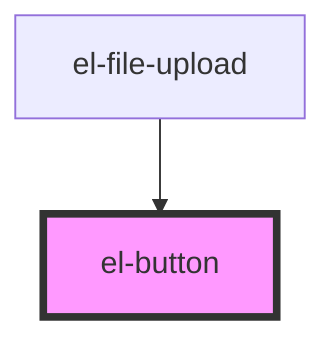

# el-button

<!-- Auto Generated Below -->

## Properties

| Property    | Attribute    | Description                                  | Type                                                            | Default     |
| ----------- | ------------ | -------------------------------------------- | --------------------------------------------------------------- | ----------- |
| `disabled`  | `disabled`   | Disabled state                               | `boolean`                                                       | `false`     |
| `fullWidth` | `full-width` | Make button take full width of its container | `boolean`                                                       | `false`     |
| `iconOnly`  | `icon-only`  | Icon-only button (no text)                   | `boolean`                                                       | `false`     |
| `loading`   | `loading`    | Loading state                                | `boolean`                                                       | `false`     |
| `size`      | `size`       | Size of the button                           | `"lg" \| "md" \| "sm" \| "xl" \| "xs"`                          | `'md'`      |
| `variant`   | `variant`    | Visual variant of the button                 | `"danger" \| "ghost" \| "primary" \| "secondary" \| "tertiary"` | `'primary'` |

## Dependencies

### Used by

 - [el-file-upload](../../organisms/el-file-upload)

### Graph

----------------------------------------------

*Built with [StencilJS](https://stenciljs.com/)*
