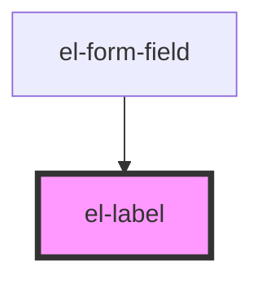

# el-label

<!-- Auto Generated Below -->

## Properties

| Property   | Attribute  | Description                              | Type                   | Default     |
| ---------- | ---------- | ---------------------------------------- | ---------------------- | ----------- |
| `for`      | `for`      | Id of the form control this label is for | `string`               | `undefined` |
| `optional` | `optional` | Mark the associated field as optional    | `boolean`              | `false`     |
| `required` | `required` | Mark the associated field as required    | `boolean`              | `false`     |
| `size`     | `size`     | Visual size                              | `"lg" \| "md" \| "sm"` | `'md'`      |

## Dependencies

### Used by

 - [el-form-field](../../molecules/el-form-field)

### Graph

----------------------------------------------

*Built with [StencilJS](https://stenciljs.com/)*
