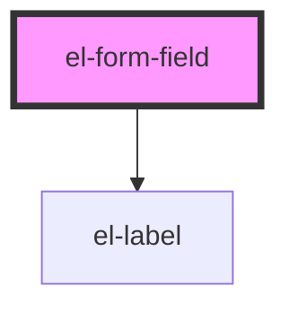

# el-form-field

<!-- Auto Generated Below -->

## Properties

| Property   | Attribute  | Description                                             | Type      | Default     |
| ---------- | ---------- | ------------------------------------------------------- | --------- | ----------- |
| `error`    | `error`    | Error text (used when no custom error slot is provided) | `string`  | `undefined` |
| `hint`     | `hint`     | Hint text (used when no custom hint slot is provided)   | `string`  | `undefined` |
| `label`    | `label`    | Label text (used when no custom label slot is provided) | `string`  | `undefined` |
| `optional` | `optional` | Mark the associated control as optional                 | `boolean` | `false`     |
| `required` | `required` | Mark the associated control as required                 | `boolean` | `false`     |

## Dependencies

### Depends on

- [el-label](../../atoms/el-label)

### Graph

----------------------------------------------

*Built with [StencilJS](https://stenciljs.com/)*
