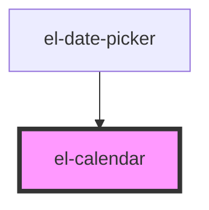

# el-calendar

<!-- Auto Generated Below -->

## Properties

| Property | Attribute | Description  | Type   | Default     |
| -------- | --------- | ------------ | ------ | ----------- |
| `value`  | --        | Current date | `Date` | `undefined` |

## Dependencies

### Used by

 - [el-date-picker](../el-date-picker)

### Graph

----------------------------------------------

*Built with [StencilJS](https://stenciljs.com/)*
