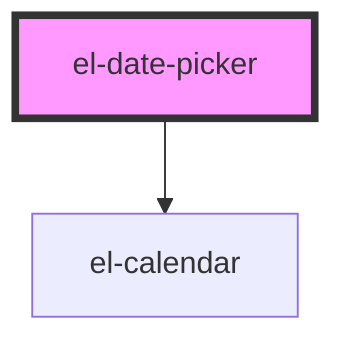

# el-date-picker

<!-- Auto Generated Below -->

## Properties

| Property      | Attribute     | Description | Type                  | Default         |
| ------------- | ------------- | ----------- | --------------------- | --------------- |
| `format`      | `format`      | Format      | `string`              | `'MM/DD/YYYY'`  |
| `placeholder` | `placeholder` | Placeholder | `string`              | `'Select date'` |
| `type`        | `type`        | Type        | `"range" \| "single"` | `'single'`      |

## Dependencies

### Depends on

- [el-calendar](../el-calendar)

### Graph

----------------------------------------------

*Built with [StencilJS](https://stenciljs.com/)*
