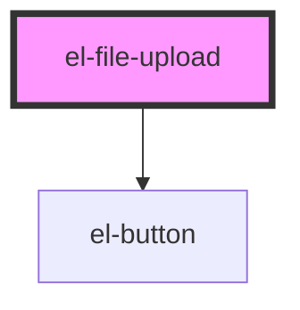

# el-file-upload

<!-- Auto Generated Below -->

## Properties

| Property   | Attribute   | Description            | Type                     | Default      |
| ---------- | ----------- | ---------------------- | ------------------------ | ------------ |
| `accept`   | `accept`    | Accept file types      | `string`                 | `undefined`  |
| `maxFiles` | `max-files` | Max files              | `number`                 | `undefined`  |
| `maxSize`  | `max-size`  | Max file size in bytes | `number`                 | `undefined`  |
| `multiple` | `multiple`  | Multiple files         | `boolean`                | `false`      |
| `variant`  | `variant`   | Variant                | `"button" \| "dropzone"` | `'dropzone'` |

## Events

| Event      | Description | Type                  |
| ---------- | ----------- | --------------------- |
| `elChange` |             | `CustomEvent<File[]>` |

## Dependencies

### Depends on

- [el-button](../../atoms/el-button)

### Graph

----------------------------------------------

*Built with [StencilJS](https://stenciljs.com/)*
